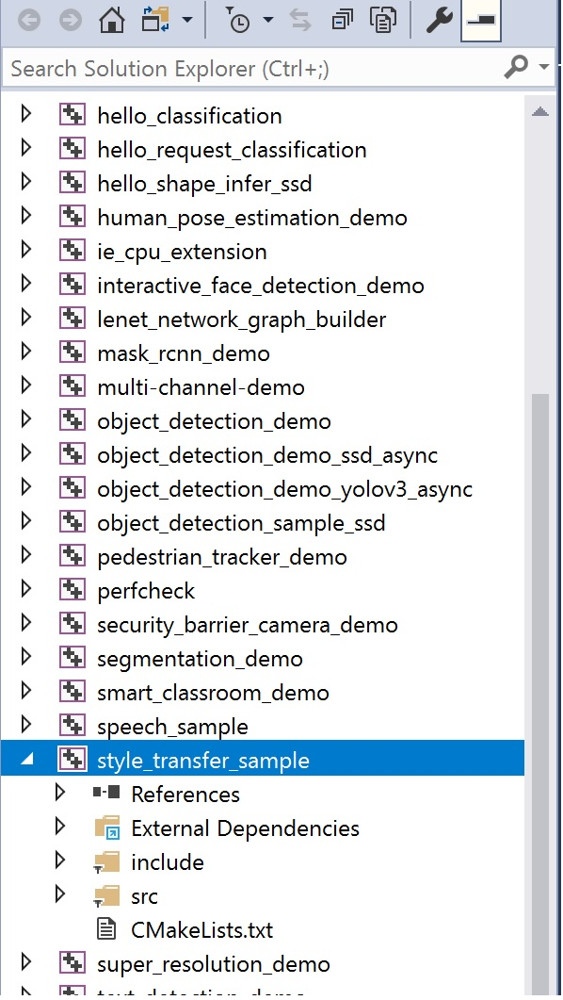
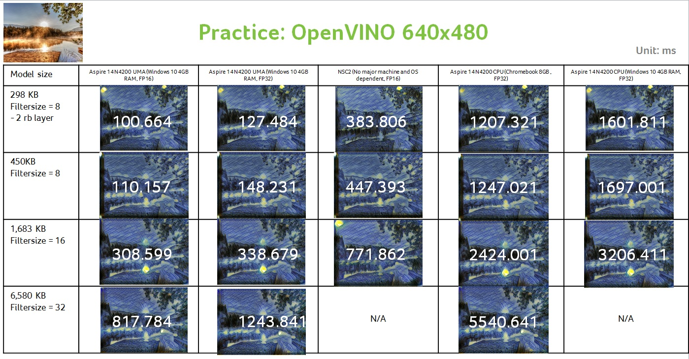

# VangoghCrazyWorld-NCS

Here is the practice about how to deploy neural style transfer samples on NCS2 (Intel® Neural Compute Stick 2) via the models trained by python code in <a href="https://github.com/acerwebai/VangoghCrazyWorld"> VangoghCrazyWorld</a>. 
Currently, the most efficient way to launch inference on NCS2 is applying <a href="https://software.intel.com/en-us/openvino-toolkit"> Intel® Distribution of OpenVINO™ toolkit</a>, therefore, the idea for practice will be 
1. training neural style transfer samples as in <a href="https://github.com/acerwebai/VangoghCrazyWorld"> VangoghCrazyWorld</a>
2. convert tensorflow frozen pb to produce an optimized Intermediate Representation (IR) via <a href="https://software.intel.com/en-us/articles/OpenVINO-ModelOptimizer"> OpenVINO Model Optimizer</a>
3. do the inference with <a href="https://software.intel.com/en-us/articles/OpenVINO-InferEngine"> OpenVINO Inference Engine</a> with the inference device set as -d MYRIAD with FP16

OpenVINO can be installed on Windows10, Linux* (supports Ubuntu*, CentOS*, and Yocto Project*) and Linux for FPGA, you can select the configuration you would like to have and do the <a href="https://software.intel.com/en-us/openvino-toolkit/choose-download"> registration and download</a>.
Please follow the guide for <a href="https://software.intel.com/en-us/articles/OpenVINO-Install-Windows"> Windows10</a> and <a href="https://software.intel.com/en-us/articles/OpenVINO-Install-Linux"> Linux</a> to do the installation correspondingly.

## Convert models
### Frozen Tensorflow Graph
 After training your own model by the python code in <a href="https://github.com/acerwebai/VangoghCrazyWorld"> VangoghCrazyWorld</a> that we modified from the code <a href="https://github.com/lengstrom/fast-style-transfer"> published by lengstrom</a>, you should get the corresponding checkpoint and frozen pb. 

 If you do not have the frozen tensorflow pb, try to do 1 inference via the following python command: 
 <pre>
 $ python evaluate.py --checkpoint checkpoint_folder
  --in-path input_preferdimension.jpg
  --out-path output.jpg
 </pre>
 where 

    --checkpoint: the folder with the checkpoint files in your Python training
    --in-path: the input with the dimension you would like to assign to this frozen graph
    --out-path: output inference image, just for reference (the major purpose is to produce frozen pb via evaluate.py)

 The evaluation will make the frozen tensorflow pb in the same checkpoint folder with checkpoint_frozen.pb
### Covert to OpenVINO optimized Intermediate Representation (IR)
Before that, please make sure you have follow the guide <a href="https://software.intel.com/en-us/articles/OpenVINO-Install-Windows"> Windows10</a> and <a href="https://software.intel.com/en-us/articles/OpenVINO-Install-Linux"> Linux</a> to do the installation and setup the <a href="https://software.intel.com/en-us/articles/OpenVINO-ModelOptimizer"> OpenVINO Model Optimizer</a> environment, due to we need execute the Python code inside OpenVINO and the corresponding toolkit has been installed. 
Now, let's convert the tensoflow frozen pb to OpenVINO optimized Intermediate Representation (IR)

<pre>
 $ C:\Intel\computer_vision_sdk\bin\setupvars.bat
 $ C:\Intel\computer_vision_sdk\deployment_tools\model_optimizer

 $ python mo_tf.py --input_model frozen.pb --data_type FP16
 </pre>
where

    --input_model: tensoflow frozen model we created from last step
    --data_type: data type can be FP32 or FP16, currently, NCS2 only support FP16, therefore, we converted to FP16 (you can convert as FP32 and running with -d CPU)

Note: you need to find the correct parameters while using <a href="https://software.intel.com/en-us/articles/OpenVINO-ModelOptimizer"> OpenVINO Model Optimizer</a>, for example, if you need convert mobilenet model via <a href="https://software.intel.com/en-us/articles/OpenVINO-ModelOptimizer"> OpenVINO Model Optimizer</a>, you need to check <a href="https://software.intel.com/en-us/articles/OpenVINO-Using-TensorFlow#inpage-nav-2-1"> Supported Topologies</a> to give the correct parameters for Mean Values (--mean_values [127.5,127.5,127.5]) and Scale Values (--scale 127.5) 

After that, you should get the converted optimized Intermediate Representation (IR) at the same (model_optimizer) folder named 
* frozen.xml
* frozen.bin 
* frozen.mapping

## Inference on NCS2
### NCS2 driver installation
Before running the inference on NCS2, be sure the NCS2 driver is well installed on <a href="https://software.intel.com/en-us/articles/OpenVINO-Install-Windows#inpage-nav-6-2"> Windows10</a> and <a href="https://software.intel.com/en-us/articles/OpenVINO-Install-Linux#inpage-nav-4-2"> Linux</a>  
### Re-compile the code
The original <a href="https://software.intel.com/en-us/articles/OpenVINO-InferEngine"> OpenVINO Inference Engine</a> sample code only support static style transfer, we did some modifications and make it more interesting as a real time inference via web cam
  

The major change we did is applying opencv to open the video stream from web cam as input frame then feed the frame to the <a href="https://software.intel.com/en-us/articles/OpenVINO-InferEngine"> OpenVINO Inference Engine</a> fto do the inference, then show both the opencv and style transfer inference stream on display.

Again, please make sure you have follow the guide <a href="https://software.intel.com/en-us/articles/OpenVINO-Install-Windows"> Windows10</a> and <a href="https://software.intel.com/en-us/articles/OpenVINO-Install-Linux"> Linux</a> to do the installation, we need the CMAKE and Visual Stdio for compilation.   
Now, go to C:\Intel\computer_vision_sdk\deployment_tools\inference_engine\samples\style_transfer_sample  
and replace 
* main.cpp 
* CMakeLists.txt   

inside this github repository 

Then go to C:\Users\arbula\Documents\Intel\OpenVINO\inference_engine_samples_2017 
* open ALL_BUILD.vcxproj via Visual Studio
  

* build style_transfer_sample as "Release", 
* then you should find executable located at C:\Users\arbula\Documents\Intel\OpenVINO\inference_engine_samples_2017\intel64\Release   

Note: if you are in Linux and follow the <a href="https://software.intel.com/en-us/articles/OpenVINO-Install-Linux"> Linux</a> installation guide, you can make a shell file as follow for compiling 
<pre>
samples_path="${INTEL_CVSDK_DIR}/deployment_tools/inference_engine/samples"
cmake -DCMAKE_BUILD_TYPE=Release $samples_path
make -j8 style_transfer_sample
</pre>
### Do the inference
Now , insert the NCS2 to USB, be note that, USB 3.0 will have better and stable throughput.  
Finally, we can do the inference on NCS2 via <a href="https://software.intel.com/en-us/articles/OpenVINO-InferEngine"> OpenVINO Inference Engine</a>
Open a command line with the command 
<pre>
style_transfer_sample.exe -m frozen.xml -d MYRIAD
</pre>
Note1: NCS2 is only support FP16 right now, so please make sure your generated optimized Intermediate Representation (IR) is with data type with FP16  
Note2: You can generate optimized Intermediate Representation (IR) with FP32 as well and running on <a href="https://software.intel.com/en-us/openvino-toolkit/hardware#IntelProcessors"> CPU</a> and <a href="https://software.intel.com/en-us/openvino-toolkit/hardware#ProcessorGraphics"> GPU</a> as well
* <a href="https://software.intel.com/en-us/openvino-toolkit/hardware#IntelProcessors"> CPU</a>: style_transfer_sample.exe -m frozen.xml -d CPU
* <a href="https://software.intel.com/en-us/openvino-toolkit/hardware#ProcessorGraphics"> GPU</a>: style_transfer_sample.exe -m frozen.xml -d GPU

Please check the link for the Intel supporting list for <a href="https://software.intel.com/en-us/openvino-toolkit/hardware#IntelProcessors"> CPU</a> and <a href="https://software.intel.com/en-us/openvino-toolkit/hardware#ProcessorGraphics"> GPU</a>.

## Inference performance adjustment
To get a more efficent inference time on NCS2, reducing the model size is necessary.  
We modify the initial value of num_filter when we training tensorflow models. To get the enough quality and acceptable inference performance, we do some experiments, and get following benchmark table.
  

As the benchmark table, we think the result of 8 num_filter and the input image with 480x480 dimension is acceptable.  
No matter inference time per frame or output quality on web experience, it get a comfortable result.
Therefore, we adjust the initial num filter to 8 from 32 that default in python code of <a href="https://github.com/lengstrom/fast-style-transfer"> published by lengstrom</a> for training models.
 

## Code change in Python due to NCS2 limitation
Due to NCS2 construct mean and variance as constant 1e-9, therefore, we did the corresponding change in Python code in _instance_norm( ) to fit the requirement.
<pre>
epsilon = 1e-3
</pre>
to 
<pre>
epsilon = 1e-9
</pre>

## Credits 

#### The author of <a href="https://github.com/lengstrom/fast-style-transfer"> fast-style-transfer by tensorflow</a>

<a href="https://software.intel.com/en-us/openvino-toolkit"> Intel® Distribution of OpenVINO™ toolkit</a>

## License

This project is licensed under the MIT, see the [LICENSE.md](LICENSE)